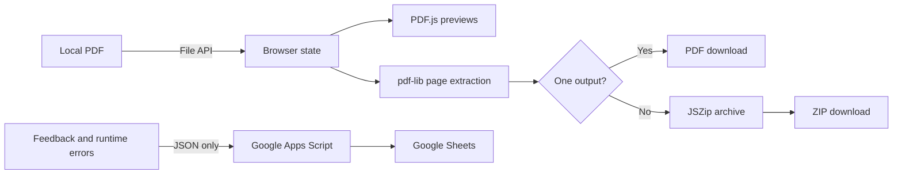

# SplitPDF

SplitPDF is a static browser application for previewing and extracting PDF pages without uploading the document to a server.

## Overview

I built SplitPDF to provide a small, inspectable alternative to PDF tools that require document uploads. The application reads a local PDF into browser memory, renders page previews, copies the requested pages into new documents, and downloads either a PDF or ZIP archive.

The core workflow lives in `index.html`; `error-tracker.js` and the Google Apps Script backend add feedback and error reporting without participating in PDF processing.

## Features

- Select individual, odd, even, all, or inverted page sets
- Export selected pages as one PDF
- Export every page as a separate PDF in a ZIP archive
- Define and export multiple custom page ranges
- Render page thumbnails and a keyboard-navigable full-page preview
- Drag page cards into a different workspace order
- Submit public or private feedback through the optional Apps Script integration

## Technical Highlights

- **Local document pipeline:** the browser reads the source with `File.arrayBuffer()`. PDF.js receives a copied byte array for rendering, while pdf-lib retains the original bytes for page extraction. The PDF itself is not posted by the splitting workflow.
- **Purpose-specific libraries:** PDF.js handles rasterized previews, pdf-lib copies pages into new PDF documents, and JSZip packages multiple outputs. This keeps document manipulation on the client and avoids a custom server or build step.
- **Explicit UI state:** page order, selection, split mode, and custom ranges are held separately. Each export mode validates its own inputs and reports progress while generating files asynchronously.
- **Download lifecycle:** generated bytes become short-lived object URLs; the application triggers a browser download and immediately revokes each URL.
- **Operational feedback loop:** the frontend reports same-origin runtime failures and user feedback to a shared Apps Script endpoint. The tracker redacts email-shaped text, filters known third-party noise, deduplicates repeated errors, and enforces a per-session report budget.
- **Backend guardrails:** the Apps Script validates known application IDs, caps field lengths, drops honeypot submissions, separates feedback from errors, and excludes emails, private messages, and error rows from the public read endpoint.
- **Static-site discoverability:** canonical metadata, structured data, `robots.txt`, `sitemap.xml`, and `llms.txt` are maintained alongside the application.

There is no automated test suite in the repository. Current verification is therefore manual in a browser, especially across the three export modes and the optional remote feedback path.

## Architecture



The PDF pipeline stops at the browser download boundary. The Apps Script integration receives feedback and diagnostic metadata, not PDF bytes.

## Tech Stack

- HTML5, CSS, and vanilla JavaScript
- [PDF.js 3.11.174](https://mozilla.github.io/pdf.js/) for parsing and rendering previews
- [pdf-lib 1.17.1](https://pdf-lib.js.org/) for creating split PDFs
- [JSZip 3.10.1](https://stuk.github.io/jszip/) for multi-file archives
- Google Apps Script and Google Sheets for feedback and error storage
- Google Analytics via `gtag.js`

The three PDF libraries are loaded from public CDNs, so the page needs network access when first loading them even though document processing is local.

## Getting Started

No installation or build step is defined. Serve the repository root over HTTP with any static file server, then open `index.html` through that server. For example, if Python 3 is available:

```bash
python -m http.server 8000
```

Then visit `http://localhost:8000/` and choose a PDF. Internet access is required for the CDN-hosted libraries. The checked-in frontend already references a deployed feedback endpoint; deploying a replacement requires following the setup comments in `google-apps-script/feedback-backend.gs` and updating the endpoint values in `index.html`.

There are no repository-defined automated test or lint commands.

## Demo

Live site: [splitpdffree.com](https://splitpdffree.com/)

Screenshot coming soon.

## Project Status

**Active.** The browser splitting workflow, static site, feedback integration, and error reporting are implemented. Automated tests and a checked-in screenshot are not present.

## What I Learned

- Keeping sensitive-file processing local changes the architecture: rendering, transformation, packaging, and download management all need browser-safe implementations.
- Separating preview rendering from PDF mutation lets each library do one job and avoids coupling the visual page model to output generation.
- Client-side observability needs aggressive filtering, redaction, deduplication, and rate limits because browser extensions and third-party scripts produce noisy failures.
- A small serverless feedback backend still needs clear trust boundaries: validate inputs, limit stored payloads, and ensure private or diagnostic data cannot leak through public reads.
